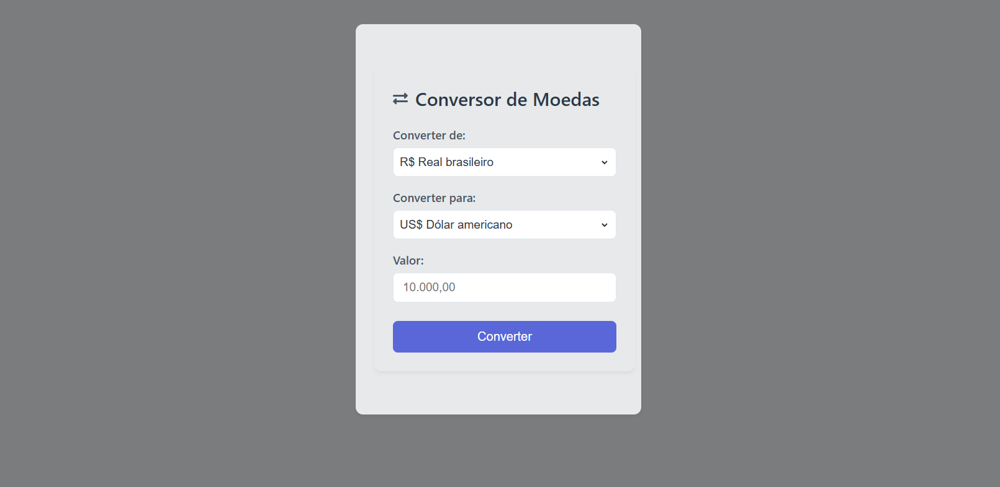

  # 🏆 Conversor de Moedas

## 📌 Sobre o Projeto

Este é um Conversor de Moedas desenvolvido em React com Styled Components. Ele permite converter valores entre diferentes moedas de forma simples e intuitiva.

## 🚀 Tecnologias Utilizadas

⚛️ React

🟦 TypeScript

💅 Styled Components

📦 Vite (para ambiente de desenvolvimento rápido)

## 🔧 Como Rodar o Projeto

### Clone o repositório
git clone https://github.com/seu-usuario/conversor-moedas.git

### Acesse a pasta do projeto
cd conversor-moedas

### Instale as dependências
npm install

### Execute o projeto
npm run dev

**Abra no navegador**

http://localhost:5173

## 📜 Licença

Este projeto está sob a licença MIT. Sinta-se à vontade para utilizá-lo e modificá-lo! 😊

